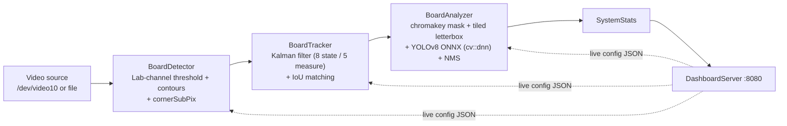
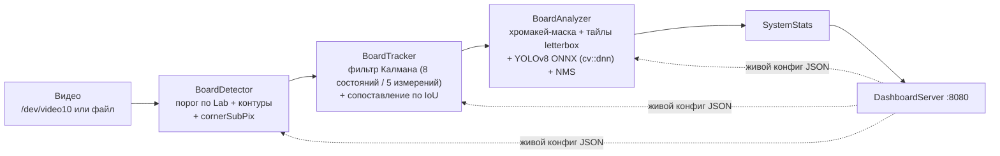

# Eastern Eye


Демон на C++ для промышленной линии: отслеживает доски на конвейере, вытаскивает их субпиксельную геометрию, ищет дефекты через YOLOv8 и отдаёт всё это в живой веб-дашборд.

*Russian version below / Русская версия ниже.*

---

## English

### What it does

Eastern Eye reads a video stream (a real camera device or a file), segments wooden boards from the conveyor background, tracks them frame-to-frame with a Kalman filter, extracts sub-pixel corner geometry, and runs a tiled YOLOv8 ONNX pass over each board to find defects (knots, cracks, resin, etc.). All runtime configuration is tunable live from a built-in web dashboard, without a rebuild or restart.

### Pipeline



Each stage is its own class: `BoardDetector` → `BoardTracker` → `BoardAnalyzer`, orchestrated by `InspectionSystem`. The dashboard reads/writes their config structs directly, serialized with `reflect-cpp`.

### Features

- **Board segmentation**: L\*a\*b\* `a`-channel threshold + morphology (open/close) + external contours, filtered by relative area, aspect ratio and position on the conveyor.
- **Sub-pixel geometry**: `cv::approxPolyDP` for the 4 corners (falls back to `minAreaRect` if the contour doesn't reduce to 4 points cleanly), refined with `cv::cornerSubPix`; corner angles are computed per-board.
- **Custom Kalman tracker**: 8-state / 5-measurement filter (`cx, cy, w, h, angle, vx, vy, vω`) per track, with angle-wrap protection so a board crossing 0°/180° doesn't cause a correction jump.
- **Data association**: predicted tracks matched to new detections by IoU of rotated rectangles (`cv::rotatedRectangleIntersection`), not a plain axis-aligned box.
- **Counting**: a board is counted once it crosses a configurable line, has been stable for N frames, and isn't currently lost — avoids double-counting on jitter.
- **Defect detection**: each board is cut into overlapping vertical tiles (`SECTION_OVERLAP_PERCENT`) sized to the model's square input, so tall boards aren't squashed into one 640×640 letterbox; results from all tiles are merged and NMS'd (`cv::dnn::NMSBoxesBatched`) as one set.
- **Background removal**: HSV chromakey mask blacks out the green background before color analysis.
- **Live dashboard**: `httplib` server + `reflect-cpp` JSON (de)serialization, config editable at runtime, stats polled on an interval.
- **Config persistence**: each config struct is saved/loaded as its own JSON file via reflection on the type name (see [Config files](#config-files)).

### Current limitations

Read straight from the code and `todo.txt`, not sugar-coated:

- `BoardAnalyzer::classifyBoard()` (Grade A/B/C by lightness + defect ratio) exists but its call site in `analyze()` is commented out — boards are **not** currently graded, and `track.category` stays empty. Category stats in the dashboard will accumulate under an empty key until this is re-enabled.
- `track.defectRatio` is declared but never computed/assigned anywhere.
- Config changes pushed via `POST /api/config` update the running process only — they are **not** written back to disk. Restart the process and it reloads whatever `AppConfig.json` had before your dashboard edits.
- Per `todo.txt`, open items are: detailed per-board API endpoints, Telegram alerts, tracker lag behind the real board, occasional lost tracks, and boards not always finishing their scan window in time. KCF → Kalman was already done and helped, but didn't fully close these out.

### Requirements

- **Compiler**: must accept `-std=c++26` — `CMakeLists.txt` sets `CMAKE_CXX_STANDARD 26` explicitly. In practice this means a recent GCC (14+) or Clang (17+) with C++26 support enabled. Most of the code itself uses C++23 facilities (`std::println`, ranges, `std::span`); the 26 flag is there for the extra features the author wanted access to.
- **CMake ≥ 4.0** — this is hard-pinned in `cmake_minimum_required(VERSION 4.0)`. C++23 itself only needs CMake 3.20+, but configuration will refuse to run below 4.0 as the file stands.
- **OpenCV 4.x**. `find_package(OpenCV REQUIRED COMPONENTS core imgproc video tracking)` only lists those four components, but the code also calls into `dnn` (`BoardAnalyzer`), `highgui` (`cv::imshow`/`waitKey`/`namedWindow`) and `videoio` (`cv::VideoCapture`). On a monolithic OpenCV build this resolves fine; on a modular one (e.g. distro packages with separate `.so` per module) you may need to add `dnn highgui videoio` to that `COMPONENTS` line if you hit undefined-reference errors at link time.
- **ccache** — optional, picked up automatically via `find_program` if present.

### Dependencies

- **reflect-cpp**: pulled in with `add_subdirectory(deps/reflect-cpp)`. CMake does **not** fetch this automatically — the directory must already contain its sources before you configure (clone the repo with `--recurse-submodules`, or vendor it manually into `deps/reflect-cpp` if it isn't a submodule in your checkout).
- **cpp-httplib**: the only dependency actually auto-fetched. If `deps/cpp-httplib/httplib.h` is missing, CMake downloads it from the upstream GitHub repo at configure time.

### The model

`BoardAnalyzer` loads the ONNX model from a hardcoded relative path: `res/v1original.onnx`. The dashboard's static page is loaded the same way, from `res/index.html`.

The build creates `build/res` as a **symlink** to the top-level `res/` directory:

```cmake
execute_process(
    COMMAND ${CMAKE_COMMAND} -E create_symlink
    ${CMAKE_SOURCE_DIR}/res ${CMAKE_BINARY_DIR}/res
)
```

So: drop `v1original.onnx` into `res/` at the project root **once** — before or after running `cmake -B build`, order doesn't matter — and it's visible to the binary whether you launch it as `./build/eastern_eye` from the repo root or as `./eastern_eye` from inside `build/`. There is no manual copy-into-build-folder step.

### Build

```bash
git clone --recurse-submodules <repo-url>
cd eastern_eye
mkdir -p res
# put v1original.onnx in res/ here
cmake -B build
cmake --build build -j $(nproc)
```

### Run

```bash
./build/eastern_eye [path/to/video.mp4]
```

If no argument is given, `main.cpp` defaults to `/dev/video10`. If the source is empty (camera hiccup, file exhausted), it retries `cap.open(videoPath)` in a loop rather than exiting.

Two ways to feed it a test file:

**Simplest** — pass the file path directly:
```bash
./build/eastern_eye path/to/video.mp4
```

**Closer to production** — expose the file as a looping virtual camera on `/dev/video10` (the repo's own `start_virtual_video.txt` recipe), then run with no argument at all:
```bash
sudo modprobe v4l2loopback devices=1 video_nr=10 card_label="Virtual CV Camera" exclusive_caps=1
ffmpeg -re -stream_loop -1 -i path/to/video.mp4 -f v4l2 /dev/video10
./build/eastern_eye
```

**Windows shown**: `Original` (live overlay — blue box = active track, orange = lost this frame, green = counted, plus centroid, ID/category/relative-area label, and drawn defect boxes) and `LAB Mask` (the detector's segmentation mask, for tuning `labAThreshold_`). `Board ROI` and `Board defects` pop up in `BoardAnalyzer::analyze()` whenever a board is actually analyzed.

**Keyboard controls**:

| Key | Action |
|---|---|
| `ESC` | Quit |
| `Space` | Pause / resume |
| `i` / `I` | Print current frame stats to the console |
| `s` / `S` | Save the current frame as `screenshot_<frameNum>.jpg` |

Trackbars in the `Original` window (`setupTrackbars` / `updatePositionTrackbar`, see `main_ui.hpp`) control playback speed and let you seek within a video file. `Ctrl+C`/`SIGTERM` are caught for a clean shutdown, printing a final per-category count summary.

### Dashboard

Once running, open **`http://localhost:8080`**. Only a subset of `AppConfig` is exposed as editable fields — the rest (YOLO score/NMS/confidence thresholds, chromakey HSV range, per-defect-class names/colors, font settings) currently lives only in the JSON config files:

| Section | Fields |
|---|---|
| Inspection system | `detectInterval`, `lineStopThresholdSec` |
| Board detector | `minRelativeArea`, `maxRelativeArea`, `minAspectRatio`, `maxAspectRatio`, `minX`/`maxX`, `minY`/`maxY`, `labAThreshold` |
| Board tracker | `minIouMatch`, `maxFramesLost`, `countLineX`, `countLineY`, `minFramesStable` |
| Board analyzer | `gradeA minLightness`, `gradeA maxDefectRatio`, `gradeB minLightness`, `gradeB maxDefectRatio` |

Stats panel (polled on an interval you set, saved to `localStorage`): active tracks, detections in the current frame, total counted, seconds since last motion, per-category counts, and a line-stopped warning once `lineStopThresholdSec` is exceeded.

**API**:

| Endpoint | Method | Does |
|---|---|---|
| `/` | GET | Serves `res/index.html` |
| `/api/config` | GET | Current `AppConfig` as JSON |
| `/api/config` | POST | Applies a new `AppConfig` — **in memory only, not persisted to disk** |
| `/api/stats` | GET | Current `StatsSnapshot` as JSON |

### Config files

`ConfigManager` derives a default filename from the struct's type name via `__PRETTY_FUNCTION__` parsing (e.g. `AppConfig` → `AppConfig.json`), written to the process's current working directory. On startup, `InspectionSystem::loadConfig()` loads `AppConfig.json` if present (falling back to the defaults in `system_configuration.hpp` otherwise) and immediately re-saves it, so the file always reflects the values actually in use after the first run.

### Project layout

```
include/                   headers, 1:1 with src/
src/                        implementation
res/                        dashboard's index.html + drop the .onnx model here
deps/                       reflect-cpp (submodule) + auto-fetched cpp-httplib
start_virtual_video.txt     v4l2loopback recipe for testing off a file
todo.txt                    open items
```

---

## Русская версия

### Что это

Eastern Eye читает видеопоток (реальную камеру или файл), выделяет доски на фоне конвейера, ведёт их между кадрами фильтром Калмана, вытаскивает субпиксельную геометрию углов и прогоняет каждую доску тайлами через YOLOv8 ONNX в поисках дефектов (сучки, трещины, смола и т.д.). Вся конфигурация правится на лету через встроенный веб-дашборд — без пересборки и рестарта.

### Пайплайн



Каждый этап — отдельный класс: `BoardDetector` → `BoardTracker` → `BoardAnalyzer`, всё это дирижирует `InspectionSystem`. Дашборд читает и пишет их конфиги напрямую, сериализация через `reflect-cpp`.

### Возможности

- **Сегментация досок**: порог по каналу `a` в L\*a\*b\* + морфология (open/close) + внешние контуры, фильтрация по относительной площади, соотношению сторон и позиции на конвейере.
- **Субпиксельная геометрия**: 4 угла через `cv::approxPolyDP` (фолбэк на `minAreaRect`, если контур не сводится чисто к 4 точкам), уточнение `cv::cornerSubPix`; для каждой доски считаются углы между гранями.
- **Кастомный Калман**: фильтр 8 состояний / 5 измерений (`cx, cy, w, h, angle, vx, vy, vω`) на трек, с защитой от скачка при переходе угла через 0°/180°, чтобы коррекция не срывалась.
- **Сопоставление данных**: предсказанные треки матчатся с новыми детекциями по IoU повернутых прямоугольников (`cv::rotatedRectangleIntersection`), а не обычного axis-aligned бокса.
- **Подсчёт**: доска считается посчитанной после пересечения настраиваемой линии, N кадров стабильности и отсутствия текущей потери — защита от двойного счёта на дребезге.
- **Обнаружение дефектов**: доска режется на перекрывающиеся по вертикали тайлы (`SECTION_OVERLAP_PERCENT`) под квадратный вход модели, чтобы длинная доска не сплющивалась в один letterbox 640×640; результаты со всех тайлов объединяются и проходят NMS (`cv::dnn::NMSBoxesBatched`) как единый набор.
- **Отсечение фона**: HSV-хромакей чернит зелёный фон перед анализом цвета.
- **Живой дашборд**: сервер на `httplib` + JSON-сериализация через `reflect-cpp`, конфиг правится на лету, статистика опрашивается с интервалом.
- **Сохранение конфигурации**: каждая структура конфига сохраняется/загружается в свой JSON-файл через рефлексию по имени типа (см. [Файлы конфигурации](#файлы-конфигурации)).

### Текущие ограничения

Прямо из кода и `todo.txt`, без прикрас:

- `BoardAnalyzer::classifyBoard()` (сорт A/B/C по светлоте + доле дефектов) в коде есть, но вызов в `analyze()` закомментирован — сорт сейчас **не** проставляется, `track.category` остаётся пустым. Статистика по категориям в дашборде будет копиться под пустым ключом, пока это не включат обратно.
- `track.defectRatio` объявлен, но нигде не вычисляется и не присваивается.
- Изменения через `POST /api/config` применяются только к работающему процессу и **не** пишутся на диск. После рестарта подхватится то, что было в `AppConfig.json` до правок в дашборде.
- Согласно `todo.txt`, в работе: эндпоинты подробной информации по API, Telegram-оповещения, отставание трекера от реальной доски, случаи потери трека, доска не всегда успевает отсканироваться в отведённое время. Замена KCF на Калман уже сделана и помогла, но полностью эти проблемы не закрыла.

### Требования

- **Компилятор**: должен принимать `-std=c++26` — в `CMakeLists.txt` явно стоит `CMAKE_CXX_STANDARD 26`. На практике это свежий GCC (14+) или Clang (17+) с поддержкой C++26. Основная часть кода опирается на возможности C++23 (`std::println`, ranges, `std::span`), а флаг 26 нужен для доступа к дополнительным фичам, которые хотел использовать автор.
- **CMake ≥ 4.0** — жёстко зафиксировано в `cmake_minimum_required(VERSION 4.0)`. Самому C++23 хватило бы 3.20+, но конфигурация не пройдёт на более старом CMake, пока файл в таком виде.
- **OpenCV 4.x**. `find_package(OpenCV REQUIRED COMPONENTS core imgproc video tracking)` перечисляет только эти четыре компонента, но код также использует `dnn` (`BoardAnalyzer`), `highgui` (`cv::imshow`/`waitKey`/`namedWindow`) и `videoio` (`cv::VideoCapture`). На монолитной сборке OpenCV всё соберётся, на модульной (например, из пакетов дистрибутива с отдельными `.so` на модуль) при ошибках линковки о неразрешённых символах добавь `dnn highgui videoio` в этот `COMPONENTS`.
- **ccache** — опционально, подхватывается автоматически через `find_program`, если найден.

### Зависимости

- **reflect-cpp**: подключается через `add_subdirectory(deps/reflect-cpp)`. CMake **не** скачивает его сам — папка должна уже содержать исходники до конфигурации (клонируй репозиторий с `--recurse-submodules`, либо положи reflect-cpp в `deps/reflect-cpp` вручную, если в твоей копии это не сабмодуль).
- **cpp-httplib**: единственная реально автоскачиваемая зависимость. Если `deps/cpp-httplib/httplib.h` отсутствует, CMake сам скачает его из апстрим-репозитория на этапе конфигурации.

### Модель

`BoardAnalyzer` грузит ONNX-модель по захардкоженному относительному пути `res/v1original.onnx`. Страница дашборда точно так же читается из `res/index.html`.

Сборка создаёт `build/res` как **симлинк** на корневую `res/`:

```cmake
execute_process(
    COMMAND ${CMAKE_COMMAND} -E create_symlink
    ${CMAKE_SOURCE_DIR}/res ${CMAKE_BINARY_DIR}/res
)
```

То есть: положи `v1original.onnx` в `res/` в корне проекта **один раз** — до или после `cmake -B build`, порядок не важен — и она будет видна что при запуске `./build/eastern_eye` из корня репозитория, что при `./eastern_eye` изнутри `build/`. Никакого ручного копирования в build-папку после сборки не требуется.

### Сборка

```bash
git clone --recurse-submodules <url-репозитория>
cd eastern_eye
mkdir -p res
# сюда кладём v1original.onnx
cmake -B build
cmake --build build -j $(nproc)
```

### Запуск

```bash
./build/eastern_eye [путь/к/видео.mp4]
```

Без аргумента `main.cpp` по умолчанию берёт `/dev/video10`. Если источник пуст (камера моргнула, файл кончился), приложение само пробует `cap.open(videoPath)` в цикле вместо падения.

Два способа скормить тестовое видео:

**Проще всего** — путь к файлу напрямую:
```bash
./build/eastern_eye путь/к/видео.mp4
```

**Ближе к продакшену** — отдать файл как зацикленную виртуальную камеру на `/dev/video10` (рецепт из `start_virtual_video.txt` в репозитории), запускать вообще без аргумента:
```bash
sudo modprobe v4l2loopback devices=1 video_nr=10 card_label="Virtual CV Camera" exclusive_caps=1
ffmpeg -re -stream_loop -1 -i путь/к/видео.mp4 -f v4l2 /dev/video10
./build/eastern_eye
```

**Окна**: `Original` (живой оверлей — синий бокс = активный трек, оранжевый = потерян в этом кадре, зелёный = посчитан, плюс центроид, метка ID/категория/относительная площадь и боксы найденных дефектов) и `LAB Mask` (маска сегментации детектора — для подбора `labAThreshold_`). `Board ROI` и `Board defects` всплывают в `BoardAnalyzer::analyze()`, когда доска реально анализируется.

**Горячие клавиши**:

| Клавиша | Действие |
|---|---|
| `ESC` | Выход |
| `Space` | Пауза / продолжение |
| `i` / `I` | Вывести статистику текущего кадра в консоль |
| `s` / `S` | Сохранить кадр как `screenshot_<номер>.jpg` |

Трекбары в окне `Original` (`setupTrackbars` / `updatePositionTrackbar`, см. `main_ui.hpp`) управляют скоростью воспроизведения и позволяют перематывать видеофайл. `Ctrl+C`/`SIGTERM` перехватываются для чистого завершения с выводом итоговой статистики по категориям.

### Дашборд

После запуска открой **`http://localhost:8080`**. Через форму редактируется только часть `AppConfig` — остальное (пороги YOLO score/NMS/confidence, HSV-диапазон хромакея, имена/цвета классов дефектов, настройки шрифта) сейчас живёт только в JSON-файлах конфигурации:

| Раздел | Поля |
|---|---|
| Система инспекции | `detectInterval`, `lineStopThresholdSec` |
| Детектор досок | `minRelativeArea`, `maxRelativeArea`, `minAspectRatio`, `maxAspectRatio`, `minX`/`maxX`, `minY`/`maxY`, `labAThreshold` |
| Трекер досок | `minIouMatch`, `maxFramesLost`, `countLineX`, `countLineY`, `minFramesStable` |
| Анализатор досок | `gradeA minLightness`, `gradeA maxDefectRatio`, `gradeB minLightness`, `gradeB maxDefectRatio` |

Панель статистики (опрос с интервалом, который сохраняется в `localStorage`): активные треки, детекции в текущем кадре, всего посчитано, секунд без движения, счётчики по категориям, предупреждение об остановке линии после превышения `lineStopThresholdSec`.

**API**:

| Эндпоинт | Метод | Что делает |
|---|---|---|
| `/` | GET | Отдаёт `res/index.html` |
| `/api/config` | GET | Текущий `AppConfig` в JSON |
| `/api/config` | POST | Применяет новый `AppConfig` — **только в памяти, без сохранения на диск** |
| `/api/stats` | GET | Текущий `StatsSnapshot` в JSON |

### Файлы конфигурации

`ConfigManager` выводит имя файла по умолчанию из имени типа структуры через разбор `__PRETTY_FUNCTION__` (например, `AppConfig` → `AppConfig.json`), записывается в текущую рабочую директорию процесса. При старте `InspectionSystem::loadConfig()` грузит `AppConfig.json`, если он есть (иначе — дефолты из `system_configuration.hpp`), и сразу же пересохраняет его, так что после первого запуска файл всегда отражает реально используемые значения.

### Структура проекта

```
include/                   заголовки, 1:1 с src/
src/                         реализация
res/                          index.html дашборда + сюда кладётся .onnx модель
deps/                         reflect-cpp (сабмодуль) + автоскачиваемый cpp-httplib
start_virtual_video.txt       рецепт виртуальной камеры для тестов на файле
todo.txt                      открытые задачи
```
